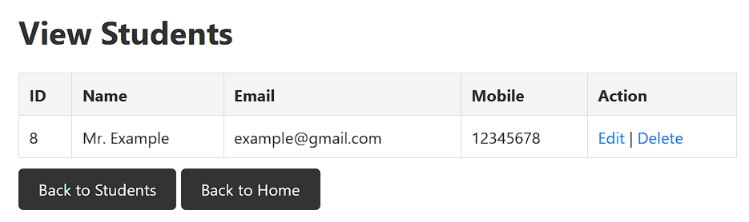

# PHP MySQL CRUD School

This is a simple web application that allows you to perform CRUD (Create, Read, Update, Delete) operations for students and teachers. It uses PHP and MySQL for database management. You can add, view, edit, and delete both student and teacher records.

## Features

- Add new students and teachers to the database.
- View a list of all students and teachers.
- Edit the information of existing students and teachers.
- Delete students and teachers from the database.

## Screenshots

## Getting Started

To get started, follow these steps:

1. Clone the repository to your local machine.
2. Set up a PHP development environment (e.g., XAMPP, WAMP, or Laragon).
3. Configure the database connection in `db_connection.php`.
4. Open the project in your web browser.
5. You can now use the application to manage student and teacher records.

## Usage

- Add new student or teacher: Click on "Add Student" or "Add Teacher" and fill in the required information.
- View records: Click on "View Students" or "View Teachers" to see a list of all records.
- Edit record: Click on "Edit" next to a record to update its information.
- Delete record: Click on "Delete" next to a record to remove it from the database.
